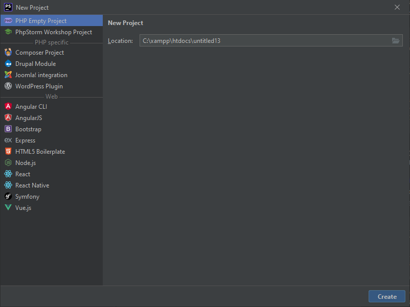

# IDE Setup for Symfony

Create a new project in PhpStorm with no configuration.
```bash
File > New Project... > PHP Empty Project
```



<div align="right">
<a href="https://github.com/agaktr/workflows/blob/master/steps/step2.md" align="right">Next: Clone Apto Library</a>
</div>  
