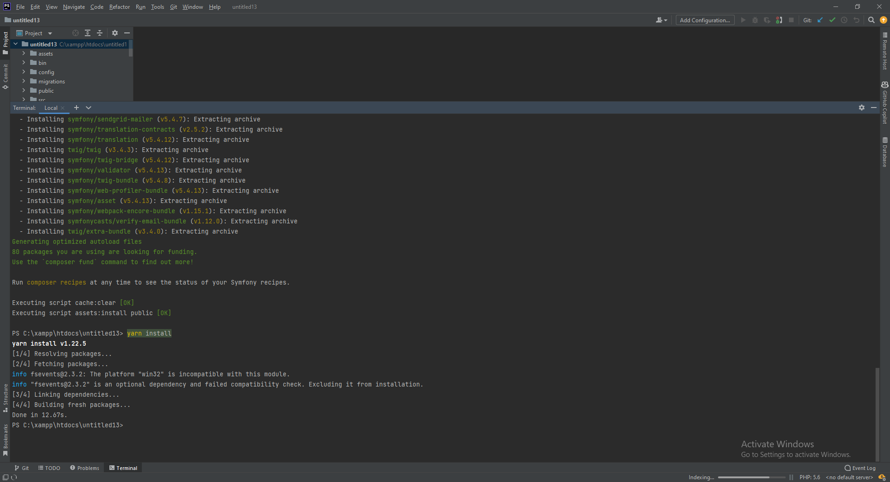

# Install Dependencies

In the terminal, run the following commands to install dependencies:
```bash
#install composer dependencies
composer install

#install yarn dependencies
yarn install
```

This will allow the IDE to understand the code and provide code completion and other useful features.


<div align="right">
<a href="https://github.com/agaktr/workflows/blob/master/steps/step4.md" align="right">Next: Create Webpack Assets</a>
</div>  
