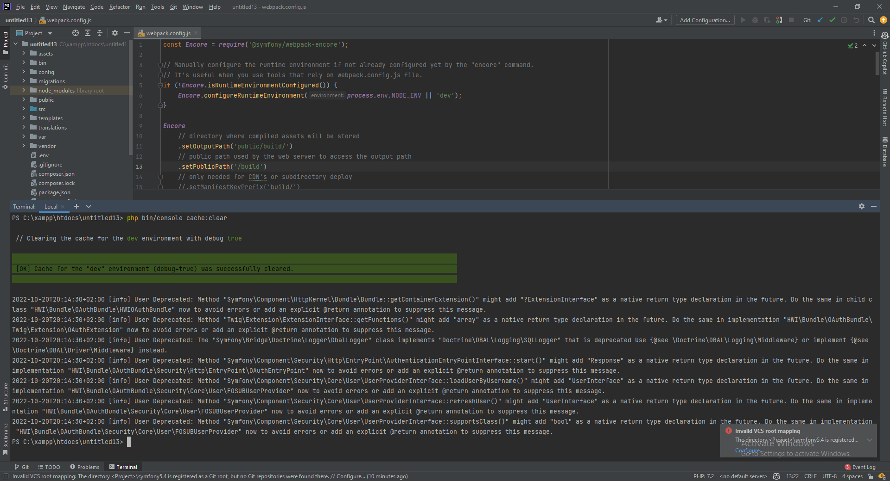

# Clear Cache

When you are done, clear the cache:
```bash
php bin/console cache:clear
```

This will make the project ready to be uploaded to our VCS (Github).



<div align="right">
<a href="https://github.com/agaktr/workflows/blob/master/steps/step5.md" align="right">Next: Upload Project to Github</a>
</div>  
