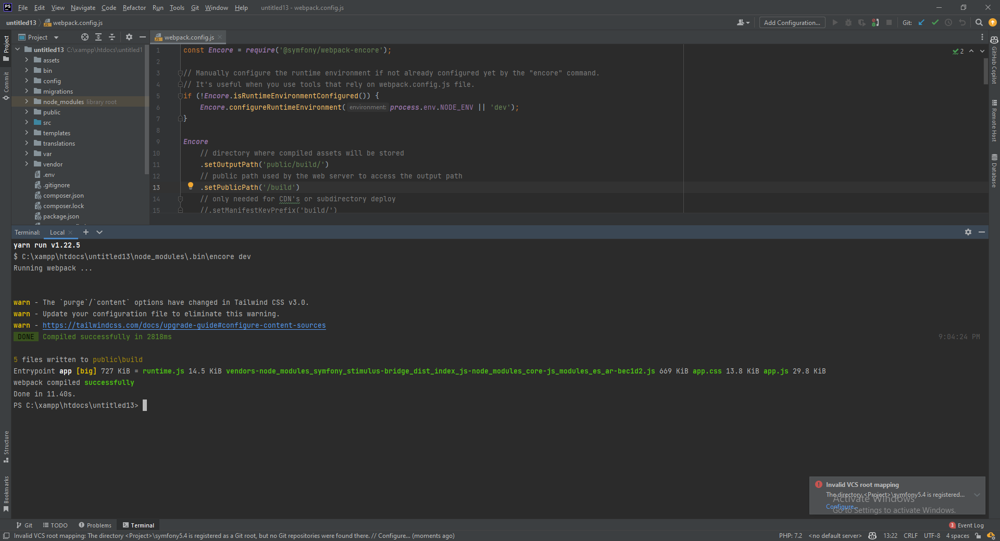

# Create Webpack Assets

If you are on a development server (ex. blackflag.cloud), we need to change the `publicPath` in `webpack.config.js` file to use the correct path for the public folder.

```bash
#change webpack.config.js file to use the correct path for the public folder
#change the following line
publicPath: '/symfony/public/build',
#to
publicPath: '/build',
```

If instead you are using XAMPP, you can use the following configuration:
```bash
#change webpack.config.js file to use the correct path for the public folder
#change the following line
publicPath: '/symfony/public/build',
#to
publicPath: '/public/build',
```

In the terminal, run the following commands to build the assets:
```bash
#build assets
yarn encore dev
#or if you want to watch for changes
yarn encore dev --watch
```

If you leave the watcher on, you can open a new terminal window and continue with the next steps.



<div align="right">
<a href="https://github.com/agaktr/workflows/blob/master/steps/step4.md" align="right">Next: Install Dependencies</a>
</div>  
