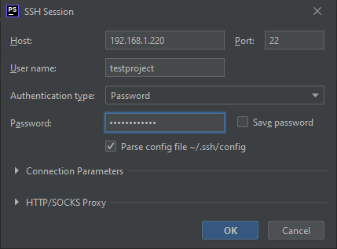

# Login to the server via SSH from PHPStorm

On the PHPStorm terminal screen, click on the caret down and select New SSH Session.
```bash
#On terminal screen
Caret down > New SSH Session

#Credentials: the same as the ones you put on the virtual server creation(2.1)
Host: 192.168.1.220
```



<div align="right">
<a href="https://github.com/agaktr/workflows/blob/master/steps/step8.md" align="right">Next: Fetch the project from github via SSH from PHPStorm</a>
</div>  
