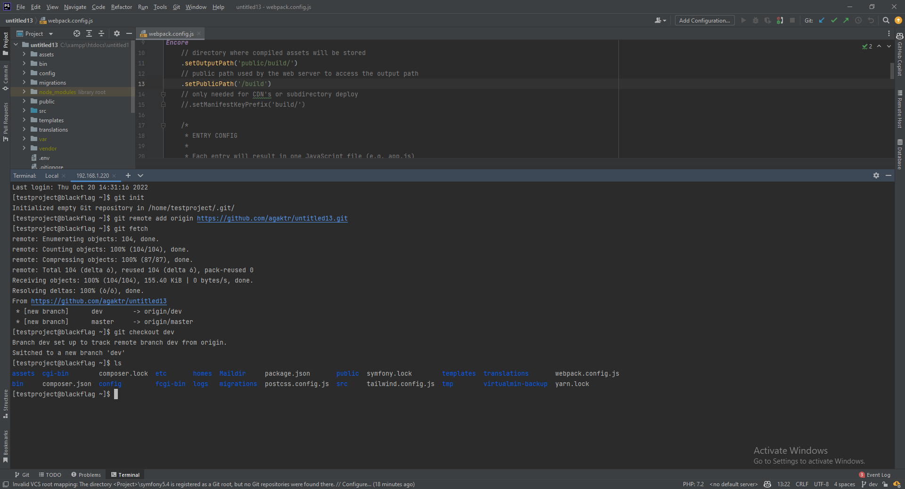

# Fetch the project from github via SSH from PHPStorm

On SSH screen(2.2), run the following commands:
```bash
#On SSH screen(2.2)
#Initialize the git repository
git init

#Add the remote origin
git remote add origin https://github.com/{user}/{repo}.git

#Fetch the project from github
git fetch

#Checkout the dev branch so you can work on it
git checkout dev
```



<div align="right">
<a href="https://github.com/agaktr/workflows/blob/master/steps/step9.md" align="right">Next: Create CRON job to deploy the dev branch</a>
</div>  
