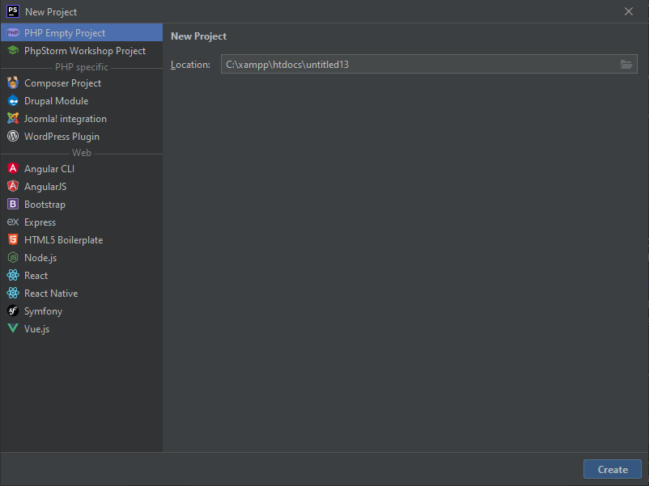
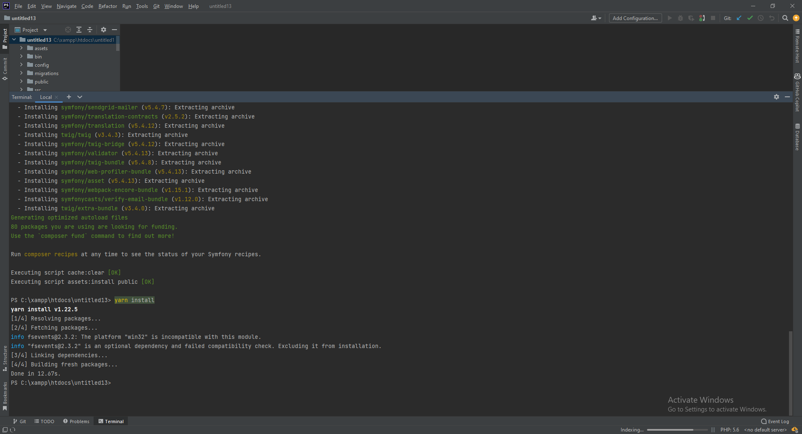
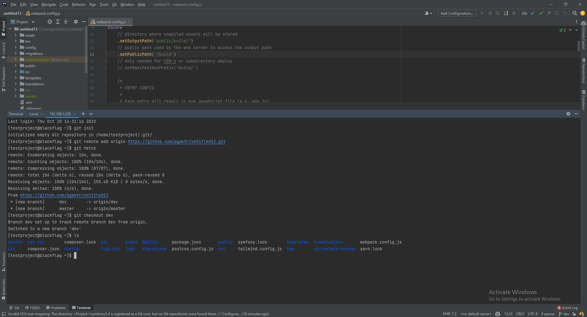

# IDE Setup for Symfony

Create a new project in PhpStorm with no configuration.
```bash
File > New Project... > PHP Empty Project
```



# Clone Apto Library

Open the project folder in the terminal and run the following commands to clone symfony5.4 project:
```bash
#Clone the repo inside your project root folder
git clone https://github.com/agaktr/apto.symfony.base.git

#copy files from symfony5.4/public_html/symfony to your project root folder
cp -r apto.symfony.base/* .

#remove the symfony5.4 folder
rm -rf apto.symfony.base
#or if you are using Windows PowerShell (PHPStorm terminal)
Remove-Item -Recurse -Force apto.symfony.base
```


# Install Dependencies

In the terminal, run the following commands to install dependencies:
```bash
#install composer dependencies
composer install

#install yarn dependencies
yarn install
```

This will allow the IDE to understand the code and provide code completion and other useful features.


# Clear Cache

When you are done, clear the cache:
```bash
php bin/console cache:clear
```

This will make the project ready to be uploaded to our VCS (Github).


# Upload Project to Github

Share the new project on github through the VCS menu:
```bash
Git > GitHub > Share Project on GitHub
#Choose all the files for the initial commit

#After you have created the repository on github, 
# create a new dev branch
git checkout -b dev

#set the upstream branch so you can push to the dev branch
git push --set-upstream origin dev
```

Now you can safely work on the dev branch and push your changes to github.
With the dev branch, you can create a pull request to the master branch when you are done with your changes.

The server will automatically deploy the dev/prod branches using a cron job.


# Setup the Dev server

Login to the server and create a new virtual server: https://blackflag.cloud:10000/

```bash

Virtualmin > Create Virtual Server

#On the page, fill in the following fields:
Domain name: {projectName}.blackflag.cloud
Administration password: {password}
Server configuration template: symfony

#On Enable features check:
Setup Apache SSL website

#After, click on 
Create Server
```


# Login to the server via SSH from PHPStorm

On the PHPStorm terminal screen, click on the caret down and select New SSH Session.
```bash
#On terminal screen
Caret down > New SSH Session

#Credentials: the same as the ones you put on the virtual server creation(2.1)
Host: 192.168.1.220
```


# Fetch the project from github via SSH from PHPStorm

On SSH screen(2.2), run the following commands:
```bash
#On SSH screen(2.2)
#Initialize the git repository
git init

#Add the remote origin
git remote add origin https://github.com/{user}/{repo}.git

#Fetch the project from github
git fetch

#Checkout the dev branch so you can work on it
git checkout dev
```



# Create CRON job to deploy the dev branch

On SSH screen(2.2), run the following commands:
```bash
#On SSH screen(2.2) run the following command
crontab -e

#Add the following line to the file
#This will run the deploy script every 1 minute
* * * * * cd /home/{projectName} && git fetch && git checkout dev && git pull origin dev 
```


# Install Dependencies

In the terminal, run the following commands to install dependencies:
```bash
#install composer dependencies
composer install

#install yarn dependencies
yarn install
```

This will install all the dependencies for the project.


# Create Webpack Assets

If you are on a development server (ex. blackflag.cloud), we need to change the `publicPath` in `webpack.config.js` file to use the correct path for the public folder.

```bash
#change webpack.config.js file to use the correct path for the public folder
#change the following line
publicPath: '/symfony/public/build',
#to
publicPath: '/build',
```

If instead you are using XAMPP, you can use the following configuration:
```bash
#change webpack.config.js file to use the correct path for the public folder
#change the following line
publicPath: '/symfony/public/build',
#to
publicPath: '/public/build',
```

```bash
#push webpack config changes to github
#then pull the new config to the dev server
git pull origin dev
```

In the terminal, run the following commands to build the assets:
```bash
#build assets
yarn encore dev
#or if you want to watch for changes
yarn encore dev --watch
```

If you leave the watcher on, you can open a new terminal window and continue with the next steps.

# Configure the .env file

This is for development server only. (ex. blackflag.cloud)
```bash
#copy the .env file and rename it to .env.local
cp .env .env.local
```

```dotenv
#edit the .env.local file and set the database credentials
DATABASE_URL="//${DB_USER}:${DB_PASSWORD}@${DB_HOST}:${DB_PORT}/${DB_NAME}?serverVersion=${DB_VERSION}"

#set the MAILER_DSN with sendgrid api key
#you can get a free sendgrid account here: https://signup.sendgrid.com/
MAILER_DSN=sendgrid://${SENDGRID_API_KEY}@default

#set the hwioauth credentials
#you can create an app on the following links:
#facebook: https://developers.facebook.com/apps/
#google: https://console.cloud.google.com/apis/credentials
#apple: https://developer.apple.com/account/resources/identifiers/list
{social}_ID=
{social}_SECRET=
```

# Create database

```bash
#Create database if it doesn't exist (most likely it does)
php bin/console doctrine:database:create

#Create tables from the already made migrations
php bin/console doctrine:migrations:migrate

#Load fixtures with sample data (optional)
php bin/console doctrine:fixtures:load
```

# Clear Cache

When you are done, clear the cache:
```bash
php bin/console cache:clear
```

You can visit the project at your dev domain (ex. http://project.blackflag.cloud)

 
  


 

  


 


